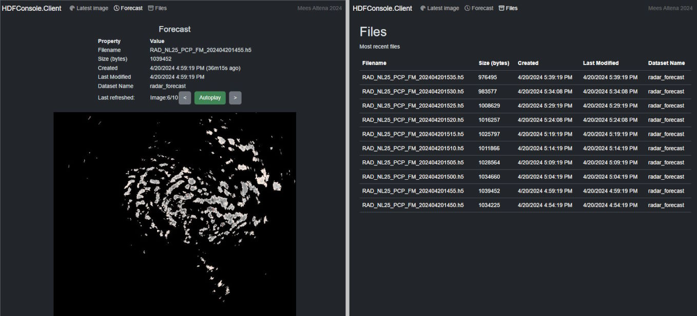

C# KNMI OpenData API Client for periodic downloading & saving of HDF5 radar data. Uses PureHDF

Note that this project is only for experiment/hobby purposes and not to be used for any serious/critical application.

### HDFConsole

.NET 8 API project with hosted service that periodically downloads & saves latest data as .H5 and .png. Images are persisted in memory cache and served via FileController & ImageController. Contains simple Views to display latest image. Uses PureHDF to handle .H5 files.

### HDFConsole.Client

Blazor WASM client to present data exposed by controllers.

